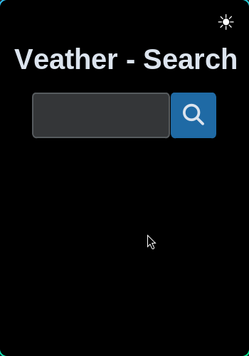
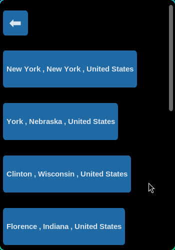
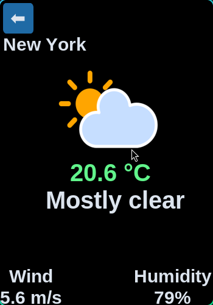

# VCast 🌤️

**VCast** is a sleek, real-time weather app built with **Python** and **CustomTkinter**. It provides accurate forecasts, dynamic weather icons, and local conditions at a glance. Powered by the [Open-Meteo API](https://open-meteo.com/), VCast combines functionality with a modern, interactive interface.

---

## Features

- Search for cities worldwide with auto-geocoding
- Hourly weather data: temperature, rain, wind speed, humidity, and cloud cover
- Dynamic weather icons for day/night conditions
- Light/Dark theme toggle
- Caching of API data for faster load times
- Scrollable results frame with smooth navigation
- Error handling and user-friendly messageboxes

---

## Screenshots





---

## Installation

1. Clone the repository:

```bash
git clone https://github.com/yourusername/VCast.git
cd VCast
```
2. Run using python:
```bash
python main.py
```

## Dependencies
[CustomTkinter](https://github.com/TomSchimansky/CustomTkinter)
[Requests](https://pypi.org/project/requests/)
[Pillow](https://pypi.org/project/pillow/)

## Usage

1. Type a city in the search bar.

2. Press Enter or click the search button.

3. View the weather details and dynamic icon for the current hour.

4. Toggle between Light and Dark themes using the button at the top-right.

### Notes

Cached data is stored in cache/ to reduce API requests.

If the app cannot find weather data or the API is unreachable, an error message will appear.

This project is a personal learning project by a Python beginner with 3 months of experience in 4 days.

### License

MIT License

### Enjoy accurate weather at a glance with VCast! 🌤️
